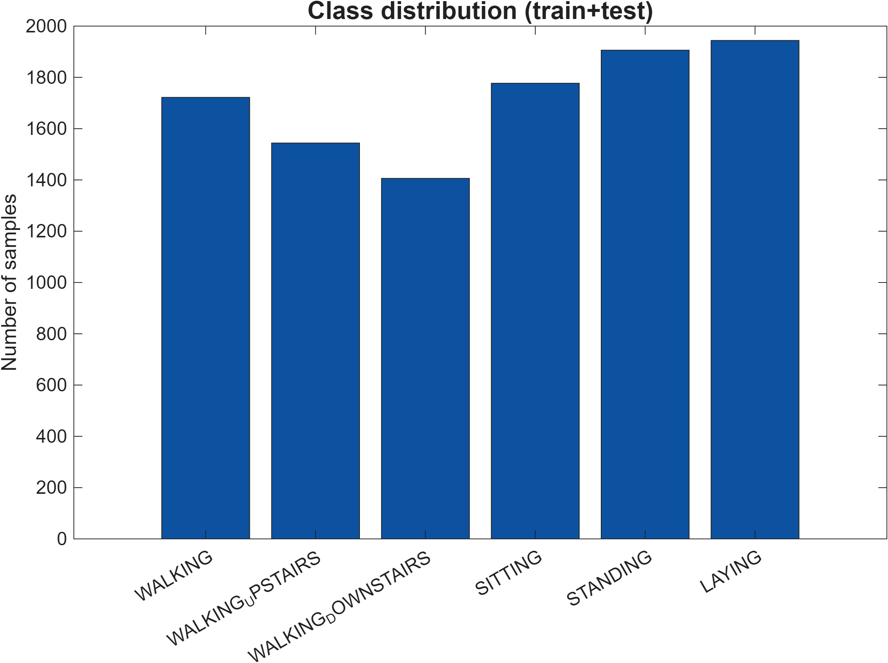
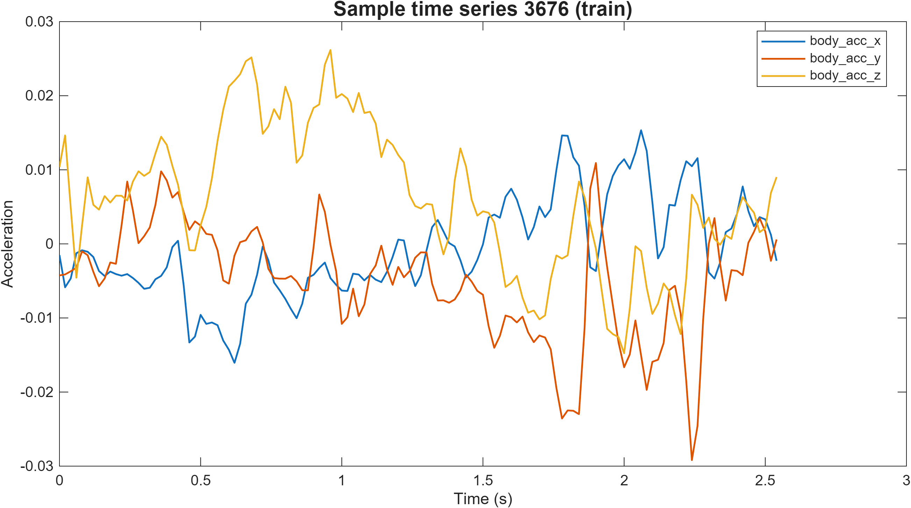
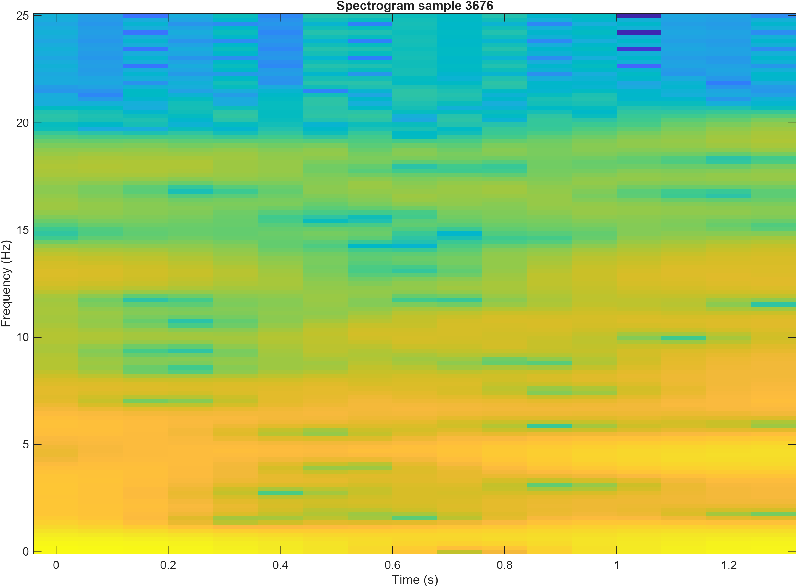

# UCI HAR – Human Activity Recognition Using Smartphones

## Overview

This repository presents an end-to-end Human Activity Recognition (HAR) pipeline developed in MATLAB using the UCI HAR dataset. The objective is to classify six human activities based on inertial sensor signals captured from a smartphone worn at the waist:

- WALKING
- WALKING_UPSTAIRS
- WALKING_DOWNSTAIRS
- SITTING
- STANDING
- LAYING

The workflow integrates:

- Loading and preprocessing of raw and pre-computed data
- Signal-processing-based feature extraction
- Statistical feature selection
- Training and evaluation of machine learning models
- Visualization utilities

The repository includes a MATLAB App Designer GUI for interactive demonstrations (`create_app_clean.m`). When available, MATLAB toolboxes (Statistics and Machine Learning Toolbox, Signal Processing Toolbox) enhance functionality; toolbox-free fallbacks are provided to ensure full operation on minimal MATLAB installations.

---

## Dataset Description

- **Source:** UCI Machine Learning Repository — Human Activity Recognition Using Smartphones Dataset
- **Device:** Samsung Galaxy S smartphone worn on the waist
- **Sampling Rate:** 50 Hz

### Sensors

- 3-axis accelerometer (body + total acceleration)
- 3-axis gyroscope

### Windowing

- 2.56-second windows (128 samples)
- Each window contains 9 time-series signals: `body_acc_x/y/z`, `body_gyro_x/y/z`, `total_acc_x/y/z`

### Pre-computed Features

- `X_train.txt`, `X_test.txt` contain ≈560 handcrafted features
- `y_train.txt`, `y_test.txt` provide six activity labels

This project uses both pre-computed feature matrices (rapid training) and raw "Inertial Signals" (custom feature extraction and spectrogram analysis).

> Note: The dataset is included in the repository under `UCI HAR Dataset/` and should not be moved; code expects the dataset at `fullfile(pwd,'UCI HAR Dataset')` relative to the project folder.

---

## Project Structure

```
UCI HAR Dataset/
results_figs/
    class_distribution.png
    sample_time_series.png
    sample_spectrogram.png
    knn_confusion_matrix.png
load_prepare.m
extract_features.m
feature_selection.m
train_models.m
tune_k_values.m
evaluate_models.m
generate_confusion_matrices.m
pipeline_run.m
create_app_clean.m
eda.m
spectrogram_utils.m
regenerate_results.m
predict_knn_model.m
save_trained_knn.m
show_results.m
har_models_results.mat
knn_model.mat
```

This layout supports:

- End-to-end pipeline execution via `pipeline_run.m`
- Full regeneration of figures via `regenerate_results.m`
- Launching the MATLAB GUI via `create_app_clean.m`

---

## Key Components

### 1) MATLAB GUI — `create_app_clean.m`

A MATLAB App Designer interface for demonstration, providing:

- Visualization of raw and normalized signals
- Sample selection and inspection
- Real-time activity prediction using the saved k-NN model
- Display of predicted labels and class probabilities

### 2) Data Loading & Preprocessing

- `load_prepare.m`: loads UCI HAR training/testing feature sets, labels, and subject IDs; performs consistency checks
- `extract_features.m`: toolbox-free feature extraction from raw Inertial Signals (mean, std, median, RMS, energy, zero-crossing rate, band-power features)

### 3) Exploratory Data Analysis & Spectrograms

- `eda.m`: class distributions, sample time-series, reference spectrogram
- `spectrogram_utils.m`: utilities for spectrogram-based feature extraction and saving spectrogram images

### 4) Feature Selection

- `feature_selection.m`: ReliefF (toolbox), F-score (toolbox-free), PCA, Sequential forward selection

### 5) Machine Learning Models

- k-NN (manual and optional `fitcknn`) — interpretable baseline
- Nearest Centroid — lightweight prototype-based baseline

Evaluation: stratified K-fold cross-validation; accuracy, precision, recall, F1-score, confusion matrices

### 6) Model Evaluation & Visualization

- `evaluate_models.m`: computes metrics and confusion matrices
- `generate_confusion_matrices.m`: publication-quality confusion matrices with activity labels
- `show_results.m`: summarization and saving utilities

### 7) Automation & Reproducibility

- `pipeline_run.m`: full workflow runner (loading → features → selection → training → evaluation)
- `regenerate_results.m`: reproduces all major figures under `results_figs/`

---

## Figures

All generated figures reside in `results_figs/` and render on GitHub using relative paths.








---

## Quick Start

1. Launch the GUI:

```matlab
app = create_app_clean();
```

2. Extract features (example):

```matlab
[F, L] = extract_features('UCI HAR Dataset');
```

3. Feature selection (example):

```matlab
optsFS.numFeatures = 50;
[selIdx, selNames, Fsel] = feature_selection(F, L, 'relieff', optsFS);
```

4. Optional hyperparameter tuning:

```matlab
[bestK, kStats] = tune_k_values(Fsel, L);
```

5. Model training (example):

```matlab
opts = struct('bestK', bestK, 'K', 5, 'tuneK', false);
results = train_models(Fsel, L, opts);
```

6. Full pipeline:

```matlab
pipeline_run('UCI HAR Dataset', struct('saveResults', true, 'summaryOnly', false));
```

7. Recreate presentation figures:

```matlab
cd human+activity+recognition+using+smartphones
regenerate_results;
```

8. Generate confusion matrices:

```matlab
generate_confusion_matrices('UCI HAR Dataset');
```

---

## Conclusion

This repository provides a complete HAR analysis framework in MATLAB with toolbox-free alternatives for broad compatibility. The included GUI, evaluation scripts, and reproducible pipeline make the project suitable for educational demonstrations, research comparisons, and rapid prototyping.

---

## Output files

- `results_figs/` — visualizations (EDA, spectrograms, confusion matrices)
- `har_models_results.mat` — stored model metrics
- `knn_model.mat` — trained k-NN classifier

---

Dataset klasör projede bulunuyor; veri klasörü taşınmadı veya silinmedi. README güncellendi, tekrar eden bölümler kaldırıldı ve örnek görseller README içinde yer alıyor.
---

## Key Scripts and Responsibilities

### 🎯 GUI Demo
- **`create_app_clean.m`** – MATLAB App Designer GUI
  - Loads the dataset and/or pre‑computed feature set
  - Shows raw signals and normalized features
  - Performs real‑time activity prediction with the trained k‑NN model
  - Designed for presentations and interactive demos

### 📊 Loading & Preprocessing of Raw / Pre‑computed Data
- **`load_prepare.m`**
  - Loads `X_train`, `X_test`, labels and subject IDs from the official UCI HAR files
  - Performs basic consistency checks on labels and dimensions

- **`extract_features.m`**
  - Implements **feature extraction from raw Inertial Signals** (your first workflow step)
  - Uses simple signal‑processing operations (FFT, statistics) to compute:
    - 9 signals (`body_acc_x/y/z`, `body_gyro_x/y/z`, `total_acc_x/y/z`)
    - 8 features per signal: mean, std, median, RMS, energy, zero‑crossing rate, and band‑power features
  - Toolbox‑free implementation

### 🔍 Exploratory Data Analysis & Spectrograms
- **`eda.m`**
  - Generates basic EDA plots:
    - Class distribution (train + test)
    - Sample time‑series for selected signals
    - A reference spectrogram for one sample

- **`spectrogram_utils.m`**
  - Unified utilities for spectrogram‑based analysis:
    - `'features'` mode: band‑power features from spectrogram
    - `'save'` mode: save a spectrogram PNG for a given sample

### 🎛️ Feature Selection (Statistical Methods)
- **`feature_selection.m`**
  - Implements several feature selection strategies:
    - ReliefF (when toolbox is available)
    - F‑score (ANOVA‑style) toolbox‑free method
    - PCA
    - Sequential forward selection

### 🤖 Training & Validation of ML Models
- **`train_models.m`**
  - Trains and evaluates **k‑NN** (manual implementation) and **Nearest Centroid** classifiers
  - Uses **K‑fold cross‑validation** with stratified folds
  - Computes accuracy, precision, recall, F1‑score and confusion matrices
  - Does **not require** `tune_k_values.m` by default – it uses a fixed `bestK` unless you explicitly enable tuning with `opts.tuneK = true`.

- **`tune_k_values.m`** (optional)
  - Optional hyperparameter tuning helper for k‑NN
  - Tries a range of odd `k` values with cross‑validation and returns the best
  - Safe to keep in the repo; the pipeline runs fine without calling it (default `opts.tuneK = false`).

### 📈 Evaluation & Visualization
- **`evaluate_models.m`**
  - Produces detailed evaluation reports and confusion matrices
  - Optionally uses MATLAB Toolbox (`confusionmat`, `confusionchart`, `perfcurve`) when available

- **`show_results.m`**
  - Convenience helper to display and save results quickly

- **`generate_confusion_matrices.m`**
  - Re‑creates high‑quality confusion matrix figures for all models in a results struct

### 🚀 Pipeline & Automation
- **`pipeline_run.m`**
  - End‑to‑end runner that glues everything together:
    # **UCI HAR – Human Activity Recognition Using Smartphones**

    ## **Overview**

    This repository presents an end-to-end **Human Activity Recognition (HAR)** pipeline implemented entirely in **MATLAB**, using the well-known **UCI HAR** dataset.
    The objective is to automatically classify six human activities using inertial sensor signals (3-axis accelerometer and gyroscope) collected from a smartphone worn at the waist:

    * **WALKING**
    * **WALKING_UPSTAIRS**
    * **WALKING_DOWNSTAIRS**
    * **SITTING**
    * **STANDING**
    * **LAYING**

    The project implements a complete workflow, including:
## UCI HAR – Human Activity Recognition Using Smartphones

### Project Overview

This repository contains an end‑to‑end **human activity recognition (HAR)** pipeline in MATLAB, built on top of the well‑known **UCI HAR** dataset. The goal is to automatically classify 6 different human activities from smartphone inertial sensor signals (3‑axis accelerometer and gyroscope) mounted on the waist:

- **WALKING**
- **WALKING_UPSTAIRS**
- **WALKING_DOWNSTAIRS**
- **SITTING**
- **STANDING**
- **LAYING**

The project demonstrates a complete workflow:

- **Loading and preprocessing of raw data**
- **Feature extraction (using signal processing techniques)**
- **Feature selection (using statistical methods)**
- **Training and validation of machine learning models**
- **Visualization of results and GUI presentation**

Alongside the command‑line pipeline, a **MATLAB App Designer GUI** (`create_app_clean.m`) is provided for interactive exploration and real‑time demos.

**MATLAB Toolboxes:** The project makes use of **Statistics and Machine Learning Toolbox** and **Signal Processing Toolbox** when available, but also includes **fallback, toolbox‑free implementations**, so the core pipeline remains usable even in more limited MATLAB installations.

---

## Dataset

- **Source**: UCI Machine Learning Repository – *“Human Activity Recognition Using Smartphones Dataset”*  
- **Device**: Samsung Galaxy S smartphone worn on the waist  
- **Sensors**:
  - 3‑axis **accelerometer** (total acceleration and body acceleration – `body_acc`)
  - 3‑axis **gyroscope** (angular velocity)
- **Sampling frequency**: \( f_s = 50 \,\text{Hz} \)
- **Raw windowing**:
  - 2.56 s windows (128 samples) for each subject and experiment
  - Each window contains 9 time‑series signals:  
    `body_acc_x/y/z`, `body_gyro_x/y/z`, `total_acc_x/y/z`
- **Pre‑computed features**:
  - `X_train.txt`, `X_test.txt` contain ≈560 features per window
  - `y_train.txt`, `y_test.txt` contain the 6 activity labels

In this project:

- Two data sources are used:
  - The **pre‑computed feature matrices** (X, y) for quick training and baselines
  - The **raw “Inertial Signals”** folders for custom feature extraction and spectrogram‑based analysis

---

## Project Structure (Workspace overview)

- **`UCI HAR Dataset/`** – Original dataset (train/test splits and Inertial Signals)
- **Main MATLAB scripts**:
  - `load_prepare.m`, `extract_features.m`, `feature_selection.m`, `train_models.m`, `tune_k_values.m`, `evaluate_models.m`, `generate_confusion_matrices.m`, `pipeline_run.m`, `create_app_clean.m`, `eda.m`, `spectrogram_utils.m`, `regenerate_results.m`, `predict_knn_model.m`, `save_trained_knn.m`, `show_results.m`
- **Models and results**:
  - `har_models_results.mat` – trained model metrics
  - `knn_model.mat` – saved k‑NN model
- **Figures**:
  - `human+activity+recognition+using+smartphones/results_figs/` – EDA plots, spectrograms, confusion matrices, sample time‑series, etc.

With this layout one can:

- Run a full training & evaluation pipeline with a single command (`pipeline_run`)
- Re‑generate all presentation figures (`regenerate_results`)
- Launch the GUI (`create_app_clean`) for interactive demos

---

## Key Scripts and Responsibilities

### 🎯 GUI Demo
- **`create_app_clean.m`** – MATLAB App Designer GUI
  - Loads the dataset and/or pre‑computed feature set
  - Shows raw signals and normalized features
  - Performs real‑time activity prediction with the trained k‑NN model
  - Designed for presentations and interactive demos

### 📊 Loading & Preprocessing of Raw / Pre‑computed Data
- **`load_prepare.m`**
  - Loads `X_train`, `X_test`, labels and subject IDs from the official UCI HAR files
  - Performs basic consistency checks on labels and dimensions

- **`extract_features.m`**
  - Implements **feature extraction from raw Inertial Signals**
  - Uses simple signal‑processing operations (FFT, statistics) to compute:
    - 9 signals (`body_acc_x/y/z`, `body_gyro_x/y/z`, `total_acc_x/y/z`)
    - 8 features per signal: mean, std, median, RMS, energy, zero‑crossing rate, and band‑power features
  - Toolbox‑free implementation

### 🔍 Exploratory Data Analysis & Spectrograms
- **`eda.m`**
  - Generates basic EDA plots:
    - Class distribution (train + test)
    - Sample time‑series for selected signals
    - A reference spectrogram for one sample

- **`spectrogram_utils.m`**
  - Unified utilities for spectrogram‑based analysis:
    - `'features'` mode: band‑power features from spectrogram
    - `'save'` mode: save a spectrogram PNG for a given sample

### 🎛️ Feature Selection (Statistical Methods)
- **`feature_selection.m`**
  - Implements several feature selection strategies:
    - ReliefF (when toolbox is available)
    - F‑score (ANOVA‑style) toolbox‑free method
    - PCA
    - Sequential forward selection

### 🤖 Training & Validation of ML Models
- **`train_models.m`**
  - Trains and evaluates **k‑NN** (manual implementation) and **Nearest Centroid** classifiers
  - Uses **K‑fold cross‑validation** with stratified folds
  - Computes accuracy, precision, recall, F1‑score and confusion matrices
  - Does **not require** `tune_k_values.m` by default – it uses a fixed `bestK` unless tuning is explicitly enabled.

- **`tune_k_values.m`** (optional)
  - Optional hyperparameter tuning helper for k‑NN
  - Tries a range of odd `k` values with cross‑validation and returns the best
  - Safe to keep in the repo; the pipeline runs fine without calling it (default `opts.tuneK = false`).

### 📈 Evaluation & Visualization
- **`evaluate_models.m`**
  - Produces detailed evaluation reports and confusion matrices
  - Optionally uses MATLAB Toolbox (`confusionmat`, `confusionchart`, `perfcurve`) when available

- **`show_results.m`**
  - Convenience helper to display and save results quickly

- **`generate_confusion_matrices.m`**
  - Re‑creates high‑quality confusion matrix figures for all models in a results struct

### 🚀 Pipeline & Automation
- **`pipeline_run.m`**
  - End‑to‑end runner that glues everything together:
    1. **Loading & preprocessing** of raw data / pre‑computed features
    2. **Feature extraction** from raw signals
    3. **Feature selection** (optional)
    4. **Training & validation** of ML models
    5. **Evaluation & visualization** (confusion matrices, etc.)

- **`regenerate_results.m`**
  - Lightweight script that only regenerates the key **presentation figures** in `results_figs`:
    - `class_distribution.png`
    - `sample_time_series.png`
    - `sample_spectrogram.png` (reference‑style spectrogram for sample 3676)
    - `knn_confusion_matrix.png`

---

## Figures

All figures generated by the project are stored in:

`human+activity+recognition+using+smartphones/results_figs/`


These figures can be reproduced at any time using the scripts mentioned above.

---

## Quick Start

### Launch the GUI

```matlab
app = create_app_clean();
```

### Extract Features

```matlab
[F, L] = extract_features('UCI HAR Dataset');
```

### Feature Selection

```matlab
optsFS.numFeatures = 50;
[selIdx, selNames, Fsel] = feature_selection(F, L, 'relieff', optsFS);
```

### Optional: Hyperparameter Tuning

```matlab
[bestK, kStats] = tune_k_values(Fsel, L);
```

### Model Training

```matlab
opts = struct('bestK', bestK, 'K', 5, 'tuneK', false);
results = train_models(Fsel, L, opts);
```

### Full Pipeline

```matlab
pipeline_run('UCI HAR Dataset', struct('saveResults', true, 'summaryOnly', false));
```

### Recreate Presentation Figures

```matlab
cd human+activity+recognition+using+smartphones
regenerate_results;
```

### Generate Confusion Matrices

```matlab
generate_confusion_matrices('UCI HAR Dataset');
```

---

## Conclusion

This repository delivers a complete and reproducible **HAR analysis framework** in MATLAB.
The workflow integrates raw-signal processing, feature engineering, traditional ML classification, cross-validated evaluation, and fully automated visualization.
The inclusion of a MATLAB GUI makes the project suitable for:

* Educational use
* Research comparisons
* Live demonstrations
* Rapid prototyping

Toolbox-free alternatives allow the pipeline to operate on a wide range of MATLAB installations while maintaining high interpretability and methodological clarity.

---

## Output Files

* **results_figs/** — visualizations (EDA, spectrograms, confusion matrices)
* **har_models_results.mat** — stored model metrics
* **knn_model.mat** — trained k-NN classifier

---

If a shorter or more academic version is needed, it can be provided as well.
    The inclusion of a MATLAB GUI makes the project suitable for:
